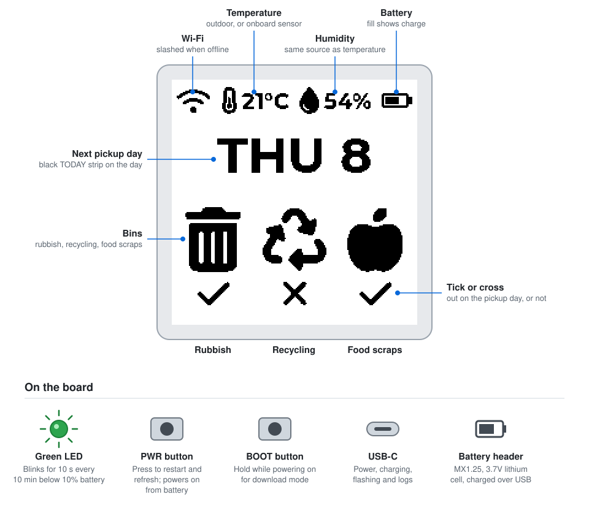
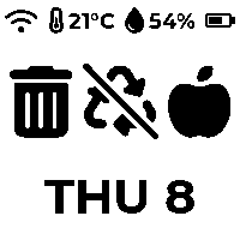
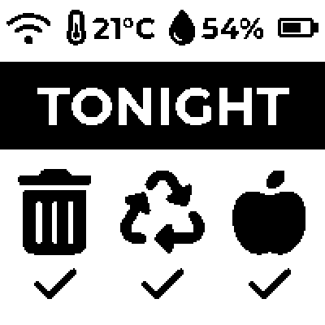
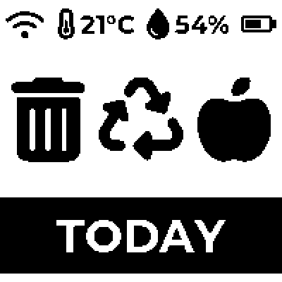
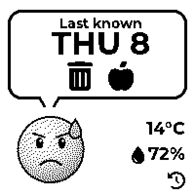
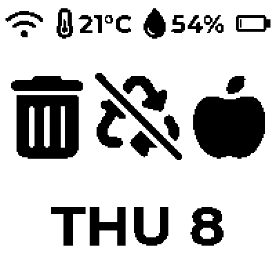
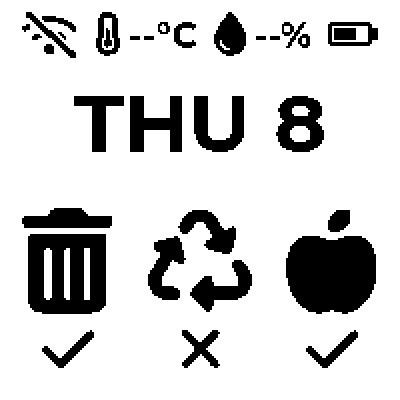

# esp-ePaper-bin-tracker

[](https://github.com/alizaliz/esp-ePaper-bin-tracker/actions/workflows/ci.yml)

A battery-powered e-paper display that shows your next Auckland Council rubbish, recycling and food scraps collection. It runs on the [Waveshare ESP32-C6 1.54" e-Paper board](https://www.waveshare.com/esp32-c6-epaper-1.54.htm), wakes once a day to fetch the schedule, and sleeps the rest of the time.



- Shows which bins go out on the next pickup day, and when it is
- Reminds you the evening before (`TONIGHT`) and on the day (`TODAY`)
- Today's average temperature and humidity, Wi-Fi status and battery level
- Keeps working through Wi-Fi outages, and flags the schedule if it may be out of date
- Blinks the LED when the battery needs charging
- Updates its own firmware from this project's releases

## Setup

### What you need
- The Waveshare ESP32-C6 1.54" e-Paper board, and a USB-C data cable
- Optional: a 3.7V lithium battery with an MX1.25 plug (it charges over USB-C)
- A computer with Python 3.10 or later, and Chrome, Edge or Firefox

<details>
<summary>No build tools? Flash a release instead</summary>

Each [release](https://github.com/alizaliz/esp-ePaper-bin-tracker/releases) includes `bin-tracker-<version>-full.bin`, a complete image to flash at address `0x0`. In Chrome or Edge, open [Espressif's web flasher](https://espressif.github.io/esptool-js/), connect to the board, add the file at address `0x0` and click **Program**. Then skip to step 3.

The full image erases everything on the board, including saved settings, so use it to set up a board from scratch. A board that's already set up updates itself (see [Firmware updates](#firmware-updates)).

</details>

### 1. Install the tools
```sh
python3 -m venv .venv
source .venv/bin/activate
pip install platformio
```

### 2. Build and flash
Plug the board in, then:
```sh
pio run -t upload      # build and flash
pio device monitor     # optional: watch the log (Ctrl+C to exit)
```
The first build downloads the ESP-IDF toolchain and LVGL, which takes a few minutes. The firmware doesn't need any of your details built in.

### 3. Configure it from the settings page
Settings are made in a web page that talks to the board over USB, and are saved on the board.

1. Open the settings page, **[alizaliz.github.io/esp-ePaper-bin-tracker/config/](https://alizaliz.github.io/esp-ePaper-bin-tracker/config/)**, in a recent desktop Chrome, Edge or Firefox.
2. Click **Connect** and choose the bin tracker. Close `pio device monitor` first, as only one program can use the port.
3. Fill in your **Wi-Fi network**, your **Assessment number**, and your **location** for the weather. To find the Assessment number, search for your address on the [Council's collection day page](https://www.aucklandcouncil.govt.nz/en/rubbish-recycling/rubbish-recycling-collections/rubbish-recycling-collection-days.html); it's also the number at the end of the results page's address.
4. Click **Save and restart**.

To use the page offline, serve it locally with `python3 -m http.server 8765 --bind 127.0.0.1 --directory docs/config` and open http://localhost:8765.

The page also sets the reminder time, the low battery level, the screen orientation and more. Come back to it any time to change them. The Wi-Fi password is never shown, and stays as it is unless you type a new one.

<details>
<summary>All settings</summary>

| Setting | Default | What it does |
| --- | --- | --- |
| Wi-Fi network and password | none | Must be a 2.4GHz network |
| Assessment number | none | Identifies your address on the Council website |
| Outdoor weather | on | Off shows the onboard sensor (indoor) instead |
| Latitude and longitude | central Auckland | Location for the weather |
| Show TONIGHT from | 18:00 | Time on the evening before a pickup when the reminder appears |
| Blink the LED at TONIGHT | on | |
| Low battery reminder | 10% | The LED double-blinks below this charge. 0 turns it off. |
| USB-C end at the top | on | Rotates the screen 180° |
| Dither greyscale images | off | Shading instead of a hard threshold |
| Indoor sensor correction | 0°C | Added to the onboard sensor's temperature |
| Fallback refresh interval | 24 hours | Only used until the clock has been set |
| Stay awake on USB | on | Keeps the board awake while a computer is connected, for flashing, logs and this page |
| Automatic updates | on | Install new firmware releases overnight |

To build your own defaults into the firmware instead, copy `src/config.example.h` to `src/config.h` (git-ignored) and edit it. Settings saved from the page override them.

</details>

### 4. Check it's working
Within about 15 seconds of restarting, the screen redraws. The log (in `pio device monitor`, or under **Device log** on the settings page) shows something like:
```
Weather (today's mean): 13.6 C, 73.0 %
Next pickup 2026-10-08: rubbish 1, recycling 1, food scraps 1
Next refresh at 2026-10-07 00:05
Computer connected over USB: staying awake for flashing, logs and the config page.
```
While it's plugged into a computer, the board stays awake. Unplug it, or run it from a battery or USB charger, and it sleeps until the next refresh.

<details>
<summary>Troubleshooting</summary>

| Problem | Fix |
| --- | --- |
| Upload can't find or connect to the board | The board is probably asleep, so its USB is off. Disconnect the battery, hold **BOOT** while unplugging and replugging USB-C, then upload again. |
| Settings page can't connect | Close `pio device monitor` or anything else using the port. If the board is asleep, press **PWR** to wake it. |
| `Failed to resolve component 'lvgl__lvgl'` | A one-off PlatformIO ordering issue on the first build after a clean. Run the build again. |
| `no Wi-Fi network set` | Set up Wi-Fi on the settings page. |
| `no connection to "<SSID>"` | Check the Wi-Fi name and password, and that the network is 2.4GHz. |
| `collection dates not found` or HTTP 406 | HTTP 406 means the Council website refused the connection: it blocks VPNs, so the board's network must connect directly. Otherwise, check the Assessment number. If it's right, the Council website layout may have changed (see Data sources under [How it works](#how-it-works)). |
| Screen shows `--` for temperature and humidity | Neither the online weather nor the onboard sensor could be read. |

</details>

## How it works

### The screen
| Upcoming pickup | Evening before | Pickup day |
| :---: | :---: | :---: |
|  |  |  |
| Rubbish and food scraps go out Thursday; recycling doesn't | From 6pm the evening before | On the day |

| Out of date | Low battery | Offline |
| :---: | :---: | :---: |
|  |  |  |
| The schedule may be stale | The LED also blinks | No Wi-Fi and no readings |

- **Top row:** Wi-Fi status (slashed if this refresh couldn't get online), temperature, humidity and battery charge.
- **Bins:** rubbish, recycling and food scraps. A bin with a slash through it isn't collected on the next pickup day.
- **Bottom:** the next pickup day, e.g. `THU 8`. It becomes `TONIGHT` from 6pm the evening before, then `TODAY` on the day.
- **Out of date:** a history icon next to the date means the schedule may be stale, so `TODAY` and `TONIGHT` are hidden. This happens when the pickup day has passed, the last successful fetch was over 48 hours ago, or the board lost power and couldn't get online.

Temperature and humidity are today's outdoor average from Open-Meteo. If that can't be fetched, the onboard sensor's indoor reading is used instead.

### Daily routine
The board spends almost all its time in deep sleep. The e-paper screen keeps its image with no power, so the schedule stays visible.

| When | What happens |
| --- | --- |
| **00:05** every night | Full refresh: connect to Wi-Fi, set the clock, fetch the schedule and weather, check for a firmware update, redraw the screen, then sleep. Takes about 5 seconds. |
| **18:00** the evening before a pickup | Full refresh showing `TONIGHT`, and a slow blink of the LED for 10 seconds |
| After a failed refresh | Retry in an hour, up to three times, then return to the normal schedule |
| Every 10 minutes, while the battery is low | Double-blink the LED for 10 seconds, then sleep again. No Wi-Fi or redraw. |
| PWR press, power on or reset | Full refresh straight away |

Any wake that runs longer than 90 seconds, for example because of a hung network request, is cut short with a retry due in an hour.

### Firmware updates
Once a night, after fetching the schedule, the board checks this project's [latest release](https://github.com/alizaliz/esp-ePaper-bin-tracker/releases/latest). If it's newer than the running firmware, the board downloads it (about a minute), restarts into it and redraws the screen.

- **Safe to fail:** the update goes into a second firmware slot. New firmware has to fetch the schedule successfully before it's kept; if it crashes or can't, the board goes back to the previous version on its next restart, and won't try that version again.
- **Skipped** when the battery is below 30%, or for firmware built on a computer (a development build) rather than a release.
- **Settings page:** shows the running version, has a **Check for updates now** button, and can turn automatic updates off.
- Saved settings and the schedule are kept across updates.

### LED and buttons
| | |
| --- | --- |
| **Green LED, slow blink** | Bin night: put the bins out |
| **Green LED, double-blink** | Battery below 10%: charge it. Stops once it's back above 15%. |
| **Red LED** | Charging. This is controlled by the board's charger, not the firmware. |
| **PWR button** | Press to restart and refresh now. On battery, it also turns the board on. |
| **BOOT button** | Hold while powering on to enter download mode for flashing |

### When things go wrong
| Situation | What you see |
| --- | --- |
| Wi-Fi down | The last schedule, a slashed Wi-Fi icon and indoor readings. Retries hourly. |
| Offline for days, or the pickup day has passed | The history icon next to the date |
| Power loss | The last schedule is saved in flash, so it's redrawn as soon as power returns |
| Council website changed | The fetch fails and the last schedule stays on screen. The parser may need updating. |

<details>
<summary>Data sources</summary>

- **Collection days:** the Council's collection day page for your address, `.../rubbish-recycling-collection-days/<assessment number>.html`. The page is about 2.7MB, but the household collection dates are in the first ~16KB, so the board stops reading once it has them. Dates come without a year, such as `Thursday, 8 October`, so the year is taken as the one in which that date falls on that weekday. This relies on the page's HTML rather than a published API, so a site redesign can break it.
- **Weather:** [Open-Meteo](https://open-meteo.com) daily mean temperature and humidity for your location, in Auckland time. It's free and needs no API key. It's fetched once a day and reused by later wakes. The request uses plain HTTP: Open-Meteo's servers are in Germany, and setting up an encrypted connection that far takes the board 3–10 seconds instead of about 1. The weather data isn't sensitive; everything else uses HTTPS.
- **Time:** NTP from `nz.pool.ntp.org`, on every wake that gets online. The clock keeps running through deep sleep.
- **Firmware updates:** the board follows `github.com/<repo>/releases/latest` to find the newest release's tag, then downloads `bin-tracker-<tag>-app.bin` from it. It doesn't use GitHub's API, which only allows 60 requests an hour per network without a login.

</details>

### Battery life
The board keeps a daily log of its battery level and activity for the last 60 days: battery voltage and percentage, number of wakes, time awake, and time spent connecting to Wi-Fi. The **Battery log** on the settings page shows it, estimates days remaining once there are three or more days of falling readings, and can download it as CSV. Time spent staying awake for a computer isn't counted.

A full refresh spends roughly 5 seconds awake: Wi-Fi about 0.8 s, clock sync under 0.1 s, weather about 1.3 s, schedule about 1.3 s and the screen about 1.4 s (each refresh logs this as `Timing (ms): ...`). **Measured with a USB power meter** (5V side, so it includes the board's charger and regulator): a refresh draws about 0.3W on average, peaking around 0.4W, which is roughly 0.14mAh from the battery. With one or two refreshes a day, that's about 0.15–0.3mAh a day. The current while asleep was below the meter's resolution, so battery life depends almost entirely on that unmeasured figure: about 50µA would give over a year on a 1000mAh battery, 1mA about six weeks. A week on battery, read from the log, or a meter in series with the battery gives the real figure.

<details>
<summary>Battery and power</summary>

- The battery voltage is read through the board's divider on GPIO0 and converted to a percentage with a lithium polymer discharge curve. With no battery connected, the charger's output reads as full.
- Wi-Fi reconnects quickly: the board remembers the router it last used (saved in flash) and connects straight to it without scanning, asks for its previous IP address, and skips the address conflict check. It usually connects in about 0.7 seconds. If the remembered router doesn't answer within 6 seconds, for example after a router change, it forgets it and scans as normal.
- Every wake keeps the board's battery power hold switched on. The panel is powered only while it's being redrawn.
- The low battery LED uses light sleep between blinks, so the 10-minute reminder wakes cost little.
- The board doesn't wait the random 0–5 seconds ESP-IDF normally adds before the first time request (meant to spread out many devices starting at once). Each sync logs how far the clock had drifted (`Clock corrected by ...`).
- Deep sleep turns off USB, so a sleeping board can't be flashed or configured. It stays awake while a computer is connected; turn off **Stay awake on USB** to test real sleep while plugged in. Chargers and power banks don't count as a computer.

</details>

## Development

<details>
<summary>Project layout</summary>

| Path | Purpose |
| --- | --- |
| `src/main.cpp` | Wake, refresh, scheduling and deep sleep |
| `src/auckland_council_client.*`, `src/council_parser.*` | Fetch and parse the collection day page |
| `src/weather_client.*` | Daily average weather from Open-Meteo |
| `src/network.*`, `src/https_client.*` | Wi-Fi, NTP and streaming HTTPS |
| `src/storage.*` | Values saved in flash (NVS): the last schedule and the settings |
| `src/ota_updater.*` | Firmware updates from GitHub releases, with rollback |
| `src/settings.*` | Settings: `config.h` defaults overridden by values saved from the page |
| `src/config_service.*` | Answers the settings page over USB serial |
| `docs/config/index.html` | The settings page (Web Serial), published with GitHub Pages |
| `tests/` | Council parser tests, fixture and the live page check |
| `.github/workflows/` | CI and releases |
| `src/display_manager.*`, `src/epd_ssd1681.*` | LVGL setup and the e-paper panel driver |
| `src/ui/bin_screen.*` | Screen layout: plain LVGL, previewable on a computer |
| `src/ui/mono_convert.*` | Greyscale to black and white, and the 180° flip |
| `src/shtc3.*`, `src/battery.*` | Onboard sensor and battery reading |
| `src/stats.*` | Daily battery and activity log |
| `src/board_power.*`, `src/board_pins.h` | I2C, the I/O expander (panel power, battery hold, LED) and pins |
| `components/fonts/` | Generated LVGL fonts: Montserrat Bold and Font Awesome icons |
| `tools/preview/` | Renders the screen to PNGs on a computer |
| `tools/fonts/generate.sh` | Regenerates the fonts |
| `tools/docs/make_images.py` | Regenerates the README images in `docs/images/` |
| `sdkconfig.defaults`, `partitions.csv` | ESP-IDF settings and the flash layout (two 4MB app slots for updates) |

</details>

<details>
<summary>Tests, CI and releases</summary>

- `tests/run.sh` runs the Council parser tests on your computer, against a saved copy of the page's markup.
- `tests/check_live.sh <assessment number>` checks the live Council page still parses, from your own connection. Run it now and then, or if boards start showing the out of date icon. The Council website refuses requests from VPNs and data centres (HTTP 406), including GitHub's servers, which is why this check isn't automated.
- **CI** (`.github/workflows/ci.yml`) runs on every push: it builds the firmware without `src/config.h`, so it's the same firmware that gets published, with no personal details. It also runs the parser tests and renders the screen previews, failing if anything is off screen. The firmware and previews are attached to each run.
- **Releases:** push a version tag to publish one, e.g. `git tag v1.0.0 && git push origin v1.0.0`. The release workflow builds the firmware, checks its version matches the tag, and attaches the app image (for over-the-air updates), a full image (for flashing from scratch) and checksums.
- The firmware's version comes from `git describe`: exactly the tag (e.g. `v1.1.0`) for release builds, otherwise something like `v1.1.0-3-gabc1234-dirty`. It's logged at boot. Boards install a release automatically only if it's newer than their version, and never replace a development build overnight; **Check for updates now** on the settings page works on any build.
- Release versions must be `vX.Y.Z`. Boards compare them numerically, so `v1.10.0` is newer than `v1.9.0`.

</details>

<details>
<summary>Previewing the screen and updating images</summary>

```sh
pio run                              # once, so LVGL is downloaded
./tools/preview/run.sh               # writes PNGs to tools/preview/out/
python3 tools/docs/make_images.py    # refreshes docs/images/ and the diagram
```
The preview uses the same layout code, fonts and black and white conversion as the firmware. It warns if anything is drawn off screen. It needs a C/C++ compiler and zlib, both included with macOS.

</details>

<details>
<summary>Fonts, icons and images</summary>

- Fonts are compiled into the firmware as bitmaps and contain only the characters the screen uses. To add characters, icons or sizes, edit `tools/fonts/generate.sh` and run it. It needs Node.js. Then add any new font to `components/fonts/CMakeLists.txt` and `fonts.h`.
- PNG images can be embedded from `src/assets/`. Add the file to `board_build.embed_files` in `platformio.ini` and declare it in `src/assets.h`. Keep them icon-sized: they're decoded to full colour in RAM.
- `DISPLAY_DITHERING` chooses between a crisp threshold (best for text and icons) and dithered shading (best for photos).

</details>

<details>
<summary>Hardware notes</summary>

Board specs, pinout and schematic: [Waveshare docs](https://docs.waveshare.com/ESP32-C6-ePaper-1.54) and [examples](https://github.com/waveshareteam/ESP32-C6-ePaper-1.54). Details that matter to this firmware:

- The e-paper panel is powered through I/O expander pin EXIO0, and the battery power hold is on EXIO5. The expander's registers are written directly and never reset, because a reset would briefly release the power hold.
- The green LED is on EXIO4 and is active low. The red LED belongs to the charger.
- Flash layout: two 4MB app slots (`ota_0` at `0x10000`, `ota_1` at `0x410000`) and the OTA record at `0x810000`. Rollback is enabled in the bootloader.
- The PWR button (GPIO2) can wake the chip from deep sleep. BOOT (GPIO9) can't, so the firmware doesn't use it.
- The project uses ESP-IDF, not Arduino, through PlatformIO. LVGL and cJSON are ESP-IDF components; `dependencies.lock` pins their versions.

</details>

## Licences
- Project code: MIT (see `LICENSE`)
- Montserrat font: SIL Open Font License 1.1
- Font Awesome Free icons: CC BY 4.0; font files SIL Open Font License 1.1 ([fontawesome.com/license/free](https://fontawesome.com/license/free))
- Weather data: [Open-Meteo](https://open-meteo.com), CC BY 4.0, free for non-commercial use
